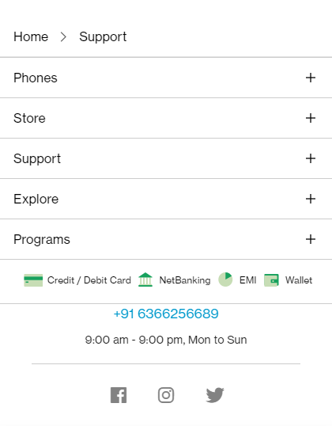
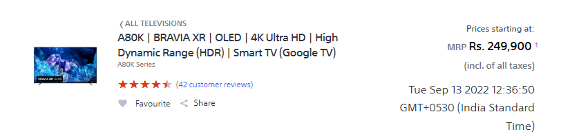

# Dom Manipulation Assignment

1. Webiste Name: [Dev To](https://dev.to/)

### Topics

    - Query Selctory, Inner HTML

### Sample Image


### Tasks

        Target the Top description div and change the DEV Community to <Your_Name> and description to your passion

### Solution

```javascript
document.querySelector(".crayons-subtitle-2").innerHTML = "Ineuron";

document.querySelector(".color-base-70").innerHTML = "I write Code";
```

### Output


2. Website Name: [Apple](https://support.apple.com/en-in)

### Task


### Fetch all the product name and store in an array

### Solution

```javacript

let names = [];

let x = document.querySelectorAll(".as-imagegrid-item");

for(let i=0 ; i<x.length; i++) {
let nameList = x[i].innerText;
names.push(nameList);
}
console.log(names)
```

### Output

['iPhone', 'Mac', 'iPad', 'Watch', 'AirPods', 'Music', 'TV']

3. Webiste Name: [Youtube Support](https://support.google.com/youtube/)

### Topics

    - Get Element By Id, Create Element, Create Text Node, Append Child

### Sample Image


### Tasks

     Add another FAQ 'My New FAQ' to the list

### Solution

```javascript
let navbar = document.querySelector(".accordion-homepage");
let newSection = document.createElement("section");
newSection.className = "parent";
const newHeading = document.createElement("h3");
newSection.appendChild(newHeading);​
newHeading.textContent = "My New FAQ";
navbar.appendChild(newSection);​
```

### Output


4. Webiste Name: [OnePlus](https://www.oneplus.in/support)

### Topics

     Query Selector, InnerText

### Sample Image


### Tasks

      Change the contact number

### solution

```javascript
let x = document.querySelector(
  ".oneplus-footer--contact__list > li > a > span"
);
x.innerHTML = "9568857551";
```

### Output



5. Webiste Name: [Samsung](https://www.samsung.com/in/offer/online/samsung-fest/)

### Topics

       getElementById, createElement, InnerText, append, setAttribute

### Sample Image


### Tasks

     Target the main div of card and change the Button text to Check out

### Solution

```javascript
document.querySelector(".diwali-deals-product-sale-btn").innerHTML = "Checkout";
```

### Output


6. Webiste Name: [Adidas](https://www.adidas.co.in/)

### Topics

    -   Query Selector, Event listeners, Changing Styles

### Sample Image


### Tasks

     Target the search box and on hover change thebackground color to red.

### Solution

```javascript
document.querySelector("._wrapper_1f3oz_1 > input").style.backgroundColor =
  "RED";
```

### Output


7. Webiste Name: [MDN Web Docs](https://developer.mozilla.org/en-US/)

### Topics

       Form, Value, Submit

### Sample Image


### Tasks

     To Search a topic in the MDN Search bar.
     First add a text to search in the search bar and then hit the submit search button to search the docs using DOM

### Solution

```javascript
let x = document.querySelector(".search-input-field");
x.value = "CSS";
let btn = document.querySelector(".search-form");
btn.submit();
```

### Output


8. Webiste Name: [Google](https://www.google.com/)

### Topics

       Remove Elements

### Sample Image


### Tasks

     Remove alternate languages from the home page languages listed

### solution

```javascript
let x = document.querySelector("#SIvCob").children;
for (let i = 0; i < x.length; i++) {
  if (i % 2 != 0) {
    x[i].remove();
  }
}
```

### Output


9. Webiste Name: [Code Wars](https://www.codewars.com/)

### Topics

       Change Font Family, Color of Text.

### Sample Image


### Tasks

    Change the font family of the text to monospace and text color to the logo’s background color.

### Solution

```javascript
document.querySelector(".text-color-white").style.fontFamily = "Arial";
document.querySelector(".text-color-white").style.color = "ORANGE";
```

### Output


10. Webiste Name: [Freecodecamp](https://www.freecodecamp.org/)

### Topics

       querySelector, mouseover, click eventListener,  callback function, style,

### Sample Image


### Tasks

    Target the button and change background colour on mouseover

### Solution

```javascript
let x = function mouseOver() {
  document.querySelector(".btn-cta-big .login-btn-text").style.backgroundColor =
    "RED";
};
document
  .querySelector(".btn-cta-big .login-btn-text")
  .addEventListener("mouseover", x);
```

### Output


11. Webiste Name: [realme](https://www.realme.com/in/)

### Topics

       querySelector,style,background-image

### Sample Image


### Tasks

    change the realme logo to ineuron logo

### Solution

```javascript
document.querySelector(".logo .icon").style.backgroundImage =
  "url('https://ineuron.ai/images/ineuron-logo.png')";
```

### Output


12. Webiste Name: [Github](https://github.com/)

### Topics

       querySelector,style,background-Color

### Sample Image


### Tasks

     change the background colour of the button to blue.

### Solution

```javascript
document.querySelector(".f4 .btn").style.backgroundColor = "BLUE";
```

### Output


13. Webiste Name: [Hackerrank](https://www.hackerrank.com/)

### Topics

       querySelector,innerHtml

### Sample Image


### Tasks

Target the top description and change “Matching developers with great companies” to ‘JSBOOTCAMP“.

### Solution

```javascript
document.querySelector(".home22-intro-text > p").innerHTML = "FSJS BOOTCAMP";
```

### Output


14. Webiste Name: [Asus](https://www.asus.com/in/)

### Topics

      querySelector,style,font-size

### Sample Image


### Tasks

       change the fontsize of “Hot Deals” to 80px

### Solution

```javascript
document.querySelector(".HotDealsAll__Heading__2fIbe").style.fontSize = "80px";
```

### Output


15. Webiste Name: [Dell](https://www.dell.com/en-in/shop/deals/laptop-deals?gacd=10415953-9016-5761040-285981356-0&dgc=ST&gclid=Cj0KCQjwguGYBhDRARIsAHgRm4-XUDMhhVNyHXb3s1gY4ZBzORr_d9Se-buhJwy7asyUe7YdqEA11eEaAt6UEALw_wcB&gclsrc=aw.ds&nclid=BxjBlpBQsX6pjSHh-L8YYSU77EpfXRkG1AGMB5Wbeu386ykspfrPDnfx_DdFau20)

### Topics

      querySelector,style.textAlign

### Sample Image


### Tasks

       Convert the text “G15 Gaming Laptop” from left to right

### Solution

```javascript
document.querySelector(
  "#d560822win9b > .ps-top > .ps-title > a"
).style.cssFloat = "right";
```

### Output


16. Webiste Name: [Vercel](https://vercel.com/)

### Topics

     querySelector,innerHTMl

### Sample Image


### Tasks

      change the heading “Start with the developer” to “Start with Scratch”

### Solution

```javascript
document.querySelector(
  "#d560822win9b > .ps-top > .ps-title > a"
).style.cssFloat = "right";
```

### Output


17. Webiste Name: [Sony](https://www.sony.co.in/)

### Topics

    querySelector,innerHTMl

### Sample Image


### Tasks

     change the button text To current Date.

### Solution

```javascript
document.querySelector(".PrimaryTout__ButtonText").innerHTML = new Date();
```

### Output



18. Webiste Name: [Philips](https://www.philips.co.in/)

### Topics

     querySelector,style,backgroundcolor

### Sample Image


### Tasks

    change the background colour blue to orange

### Solution

```javascript
document.querySelector(
  ".p-f03-footer-container > p-footer"
).style.backgroundColor = "ORANGE";
```

### Output


19. Webiste Name: [Canon](https://in.canon/)

### Topics

          querySelector,src

### Sample Image


### Tasks

    extract the canon logo

### Solution

```javascript
let x = document.querySelector(".p-header__head--brand-image").src;
console.log(x);
```

### Output


20. Webiste Name: [Oppo](https://www.oppo.com/in/)

### Topics

          querySelector,style,color

### Sample Image


### Tasks

      Change the description colour black to orange

### Solution

```javascript
let x = document.querySelectorAll(".product-card-content .narrow .desc");
x[1].style.color = "ORANGE";
```

### Output


